# Frontend Mentor - Rock, Paper, Scissors solution

This is a solution to
the [Rock, Paper, Scissors challenge on Frontend Mentor](https://www.frontendmentor.io/challenges/rock-paper-scissors-game-pTgwgvgH)
. Frontend Mentor challenges help you improve your coding skills by building realistic projects.

## Table of contents

- [Overview](#overview)
    - [The challenge](#the-challenge)
    - [Screenshot](#screenshots)
    - [Links](#links)
- [My process](#my-process)
    - [Built with](#built-with)
    - [What I learned](#what-i-learned)
    - [Continued development](#continued-development)
    - [Useful resources](#useful-resources)
- [Author](#author)

## Overview

### The challenge

Users should be able to:

- View the optimal layout for the game depending on their device's screen size
- Play Rock, Paper, Scissors against the computer
- Maintain the state of the score after refreshing the browser _(optional)_
- **Bonus**: Play Rock, Paper, Scissors, Lizard, Spock against the computer _(optional)_

### Screenshots

#### Rock Paper Scissors

##### Desktop view

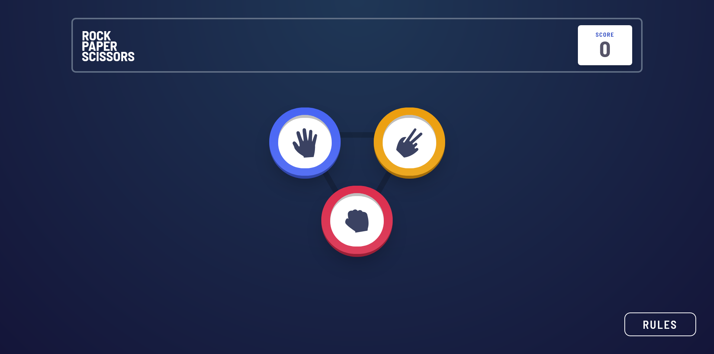
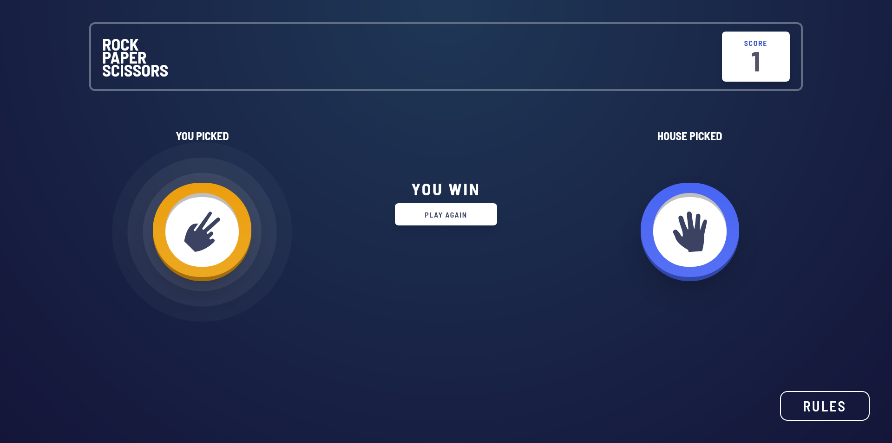
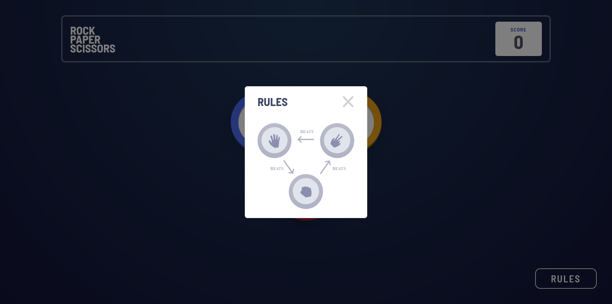

##### Mobile view

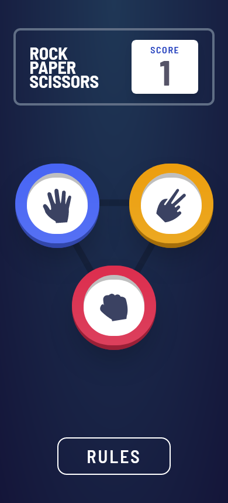
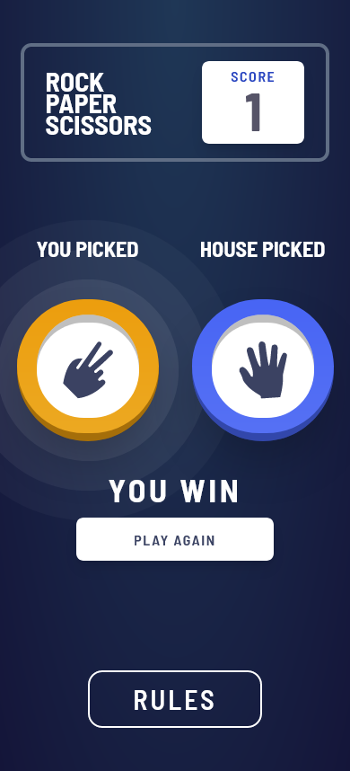
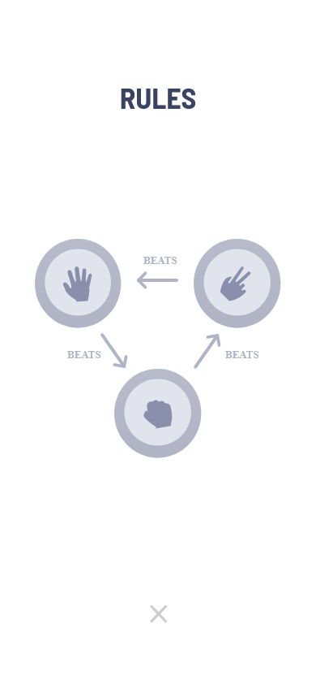

#### Rock Paper Scissors Lizard Spock

##### Desktop view

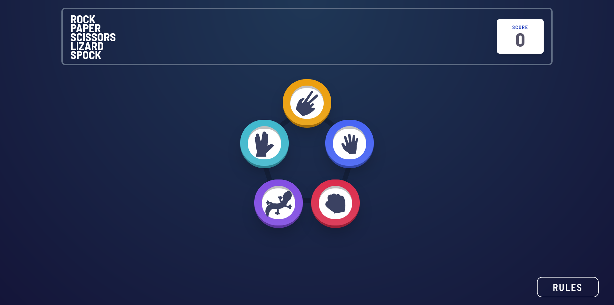
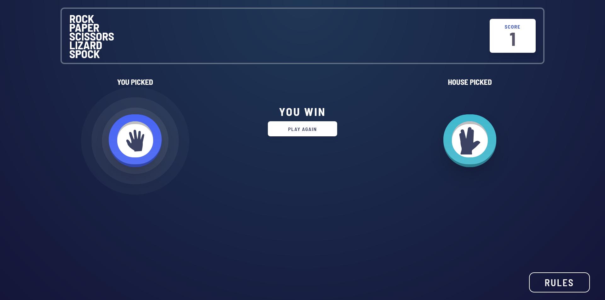
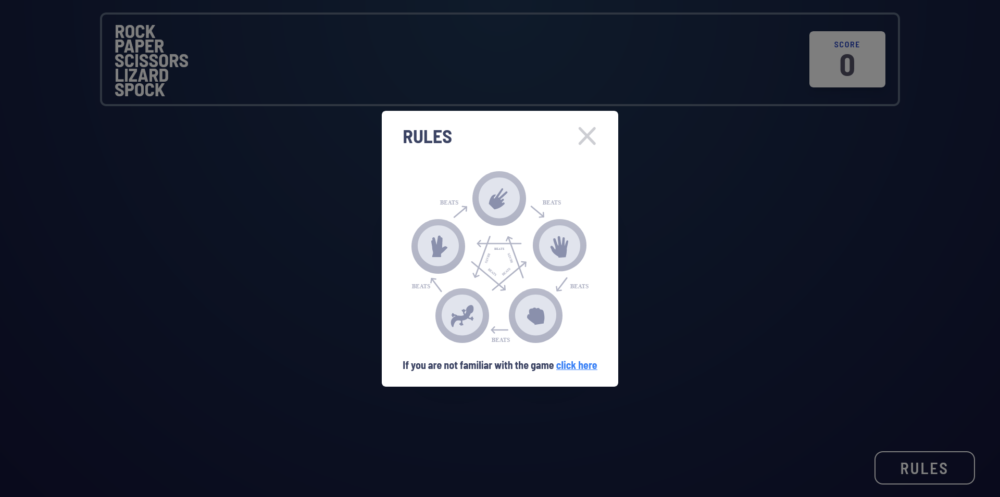

##### Mobile view

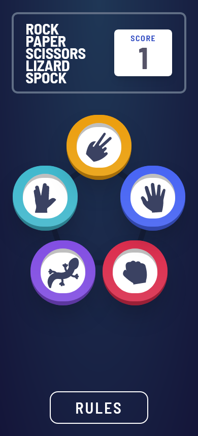
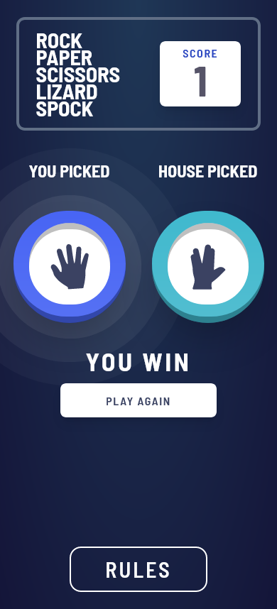
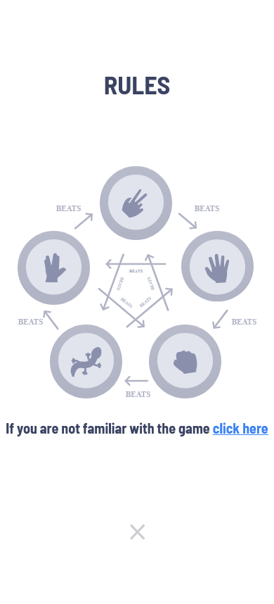

### Links

- Solution URL: [Github](https://github.com/Yazeed-Idris/rock-paper-scissors)
- Live Site URL: [Github Pages](https://yazeed-idris.github.io/rock-paper-scissors-production/)
- Live Site URL (Bonus): [Github Pages](https://yazeed-idris.github.io/rock-paper-scissors-lizard-spock-production/)

## My process

### Built with

- [React](https://react.dev/)
- [Vite](https://vitejs.dev/)
- [TailwindCSS](https://tailwindcss.com/)

### What I learned

The most tricky part of this challenge was how to put the moves in their correct place as in the design. My first
approach was to use flexbox as the display, which worked okay for the most part for the basic challenge (Rock Paper
Scissors). However, it would have been a nightmare to use it to do the bonus challenge. So I moved to the grid approach,
which proved to be a better design. Below is the grid design I used to do both challenges

#### Rock Paper Scissors

```jsx

<div className="grid grid-cols-3 grid-rows-2 place-items-center w-full h-full absolute top-0 left-0">
    <div className='flex col-start-1 col-end-4 justify-around sm:justify-between w-full'>
        <div onClick={() => handleClick('paper')}>
            <MoveBadge move={"paper"}/>
        </div>
        <div onClick={() => handleClick('scissors')}>
            <MoveBadge move={"scissors"}/>
        </div>
    </div>
    <div onClick={() => handleClick('rock')} className="col-start-2 row-start-2 mb-4">
        <MoveBadge move={"rock"}/>
    </div>
</div>

```

#### Rock Paper Scissors Lizard Spock

```jsx
 <div className="grid grid-cols-11 grid-rows-11 place-items-center w-full h-full absolute top-0 left-0">
    <div onClick={() => handleClick('spock')} className={`col-start-3 row-start-2 mt-[-2rem]`}>
        <MoveBadge move={"spock"}/>
    </div>
    <div onClick={() => handleClick('lizard')} className={`col-start-4 row-start-7`}>
        <MoveBadge move={"lizard"}/>
    </div>
    <div onClick={() => handleClick('scissors')} className={`col-start-6 row-start-1`}>
        <MoveBadge move={"scissors"}/>
    </div>
    <div onClick={() => handleClick('rock')} className={`col-start-8 row-start-7 `}>
        <MoveBadge move={"rock"}/>
    </div>
    <div onClick={() => handleClick('paper')} className={`col-start-9 row-start-2 mt-[-2rem]`}>
        <MoveBadge move={"paper"}/>
    </div>
</div>
```

### Continued development

The main part that needs more refactoring is the MoveBadge component because it includes many repetitive code and styles
that can be more optimized.

### Useful resources

- [Stack Overflow](https://stackoverflow.com/) - This site is the first place I look for answers about a problem I'm
  facing.
- [W3Schools](https://www.w3schools.com/) - Whenever I want to learn any css property, javascript function, or even try
  them out for myself, I always use this site.

## Author

- Github - [@Yazeed-Idris](https://github.com/Yazeed-Idris)
- Frontend Mentor - [@Yazeed-Idris](https://www.frontendmentor.io/profile/Yazeed-Idris)
- LinkedIn - [@Yazeed Idris](https://www.linkedin.com/in/yazeed-idris/)
